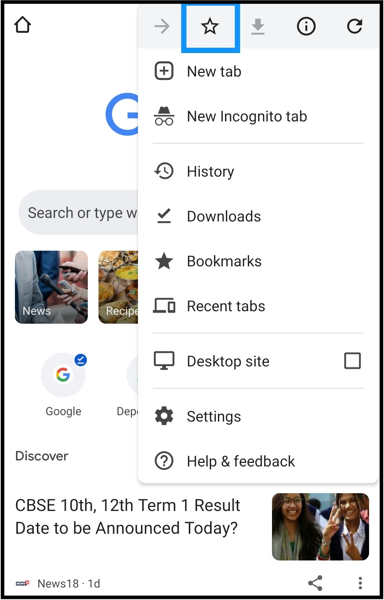
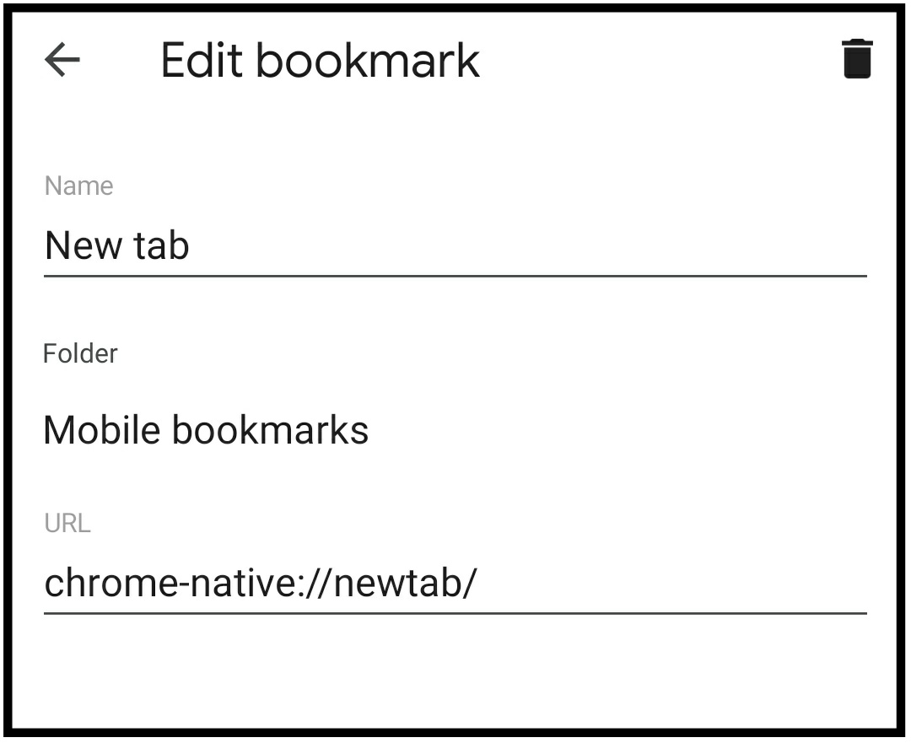
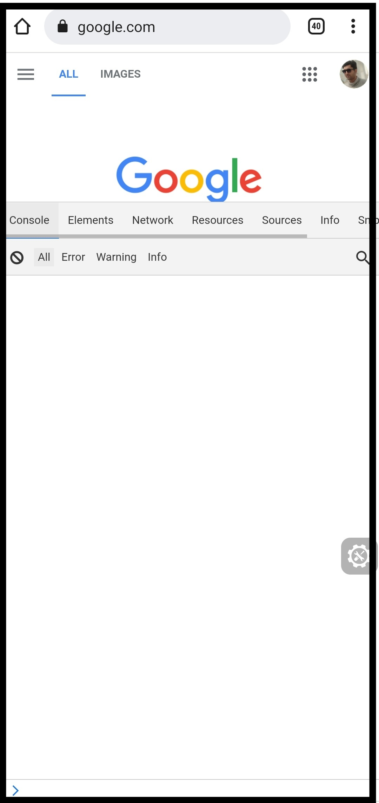

# Inspect-Element-For-Android-IOS

## Steps

**1. Open your favourite browser**

**2. Open a new tab**<br><br>

<br><br><br>

**3. Bookmark it**<br><br>
<br><br><br>

**4. You should see a toast message as Bookmarked at the bottom, where you have to click on edit button**<br><br>
<br><br><br>

**5. You will be redirected to Edit bookmark page where you can see Name, Folder and URL**<br><br>
<br><br><br>

**6. Edit name as Inspect Element (or any name you may feel like)**<br><br>
<br><br><br>

**7. Now, copy the following code and paste it in URL section**<br>

```javascript
javascript:(function () { var script = document.createElement('script'); script.src="//cdn.jsdelivr.net/npm/eruda"; document.body.appendChild(script); script.onload = function () { eruda.init() } })();
```

<br><br><br>

**8. Now, go back and visit the page/website you want to inspect**<br><br>
<br><br><br>

**9. In the search/address bar, enter the name as Inspect Element. You will see the link that you just recently bookmarked**<br><br>
<br><br><br>

**10. Click on that URL and you will see an icon**<br><br>
<br><br><br>

**11. Click on that icon to open the tool**<br><br>
<br><br>
That's it. You are good to go now.
 
<hr>
 
# Do you want to execute some script on Console?

**1. You will see a small arrow on bottom left, just click on that to start writing scripts**<br><br>
<br><br><br>

**Try the following code**<br>
```
console.log(((5 & 1) != 0) ? "Odd" : "Even");
```
<br><br>
**2. Click on the Execute button**<br><br>
<br><br><br>

**3. After execution**<br><br>
<br><br>
<hr>

# Want to play more around it?

**1. Theme**<br>
* **Go to Settings tab**<br><br>
<br><br><br>

* **Select Theme and change as per your choice**<br><br>
<br><br><br>

* **After changing theme**<br><br>
<br><br>

**2. Display**<br><br>
* **Resize the display**<br><br>
<br><br><br>

* **After changing display size**<br><br>
<br><br><br>

# Features

**Credits**


You can play around with more stuffs like these on your own. Give it a try

If you find this useful, give a star
