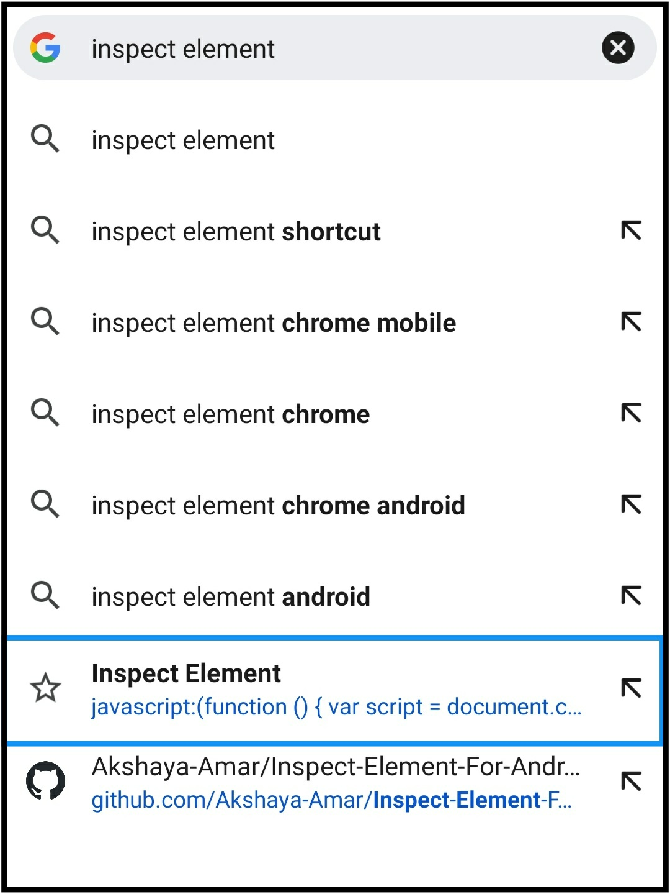
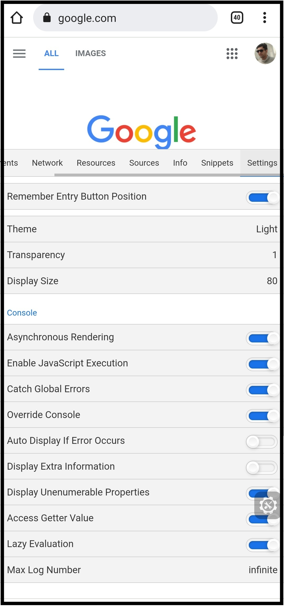

**If you find this useful, give it a** &#11088;

# Inspect Element For Android/IOS 

## Follow the Steps to enable the Developer tool in your mobile's browser

**1. Open your favourite browser**<br>
It can be either **Google Chrome** or **Firefox** or **Safari**. **100%** Working on all mentioned browsers.

**2. Open a new tab**<br>


<br><br>

**3. Bookmark it**<br>


<br><br>

**4. You should see a toast message as Bookmarked at the bottom, where you have to click on edit button**<br>


<br><br>

**5. You will be redirected to Edit bookmark page where you can see Name, Folder and URL**<br>


<br><br>

**6. Edit name as Inspect Element (or any name you may feel like)**<br>


<br><br>

**7. Now, copy the following code and paste it in URL section**<br>

```javascript
javascript:(function () { var script = document.createElement('script'); script.src="//cdn.jsdelivr.net/npm/eruda"; document.body.appendChild(script); script.onload = function () { eruda.init() } })();
```
<br>
<br><br>

**8. Now, go back and visit the page/website you want to inspect**<br>

<br><br>

**9. In the search/address bar, enter the name as Inspect Element. You will see the link that you just recently bookmarked**<br>

<br><br>

**10. Click on that URL and you will see an icon**<br>


<br>

**11. Click on that icon to open the tool**<br>


<br><br>

**That's it. You are good to go now.**
<br>
 
# Do you want to execute some script on Console?

**1. You will see a small arrow on bottom left, just click on that to start writing scripts**<br>


<br><br>

**Try the following code**<br>
```
console.log(((5 & 1) != 0) ? "Odd" : "Even");
```
<br>

**2. Click on the Execute button**<br>


<br><br>

**3. After execution**<br>


<br>

# Want to play more around it?

**1. Theme**<br>

* **Go to Settings tab**<br>


<br><br>

* **Select Theme and change as per your choice**<br>


<br><br>

* **After changing theme**<br>


<br><br>

**2. Display**<br>

* **Resize the display**<br>


<br><br>

* **After changing display size**<br>


<br>

You can play around with more stuffs like these on your own. Give it a try

## Features

* [Console](doc/TOOL_API.md#console): Display JavaScript logs.
* [Elements](doc/TOOL_API.md#elements): Check dom state.
* [Network](doc/TOOL_API.md#network): Show requests status.
* [Resource](/doc/TOOL_API.md#resources): Show localStorage, cookie information.
* [Info](doc/TOOL_API.md#info): Show url, user agent info.
* [Snippets](doc/TOOL_API.md#snippets): Include snippets used most often.
* [Sources](doc/TOOL_API.md#sources): Html, js, css source viewer.

## Credits 
[Eruda](https://github.com/liriliri/eruda)<br>
Eruda is an open source javascript package publicly hosted on github.

**If you find this useful, give it a** &#11088;
